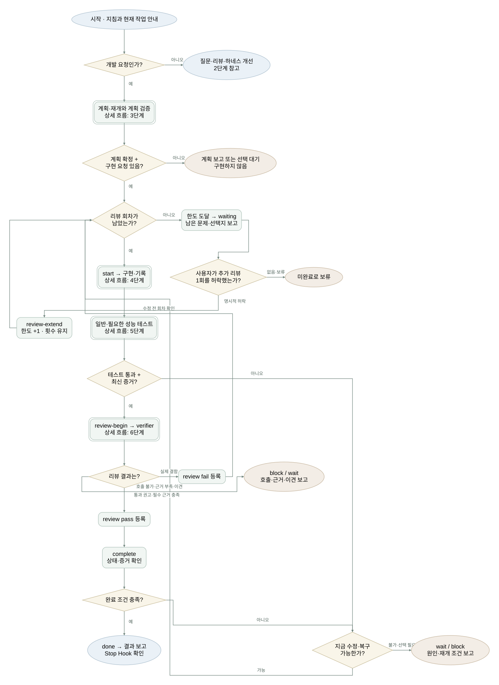
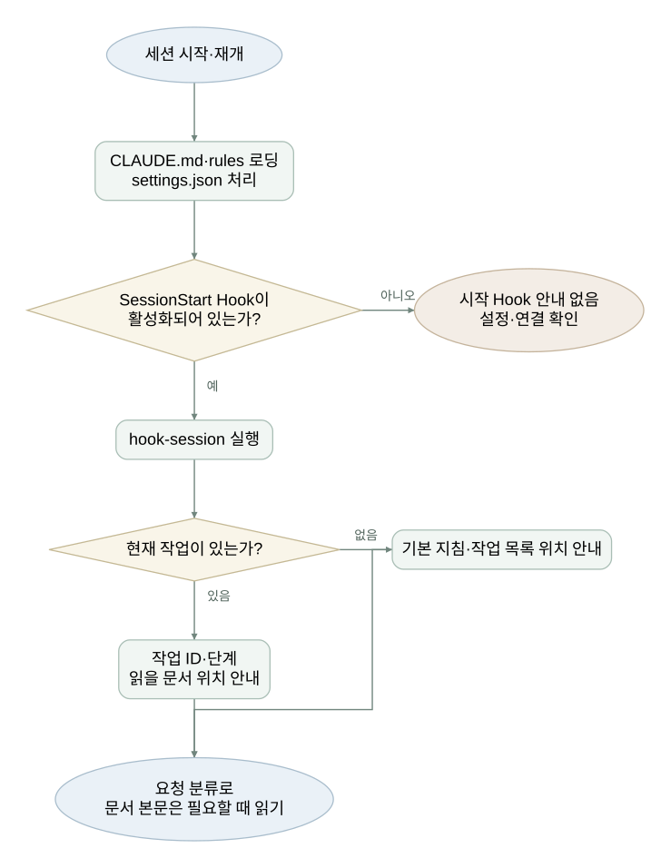
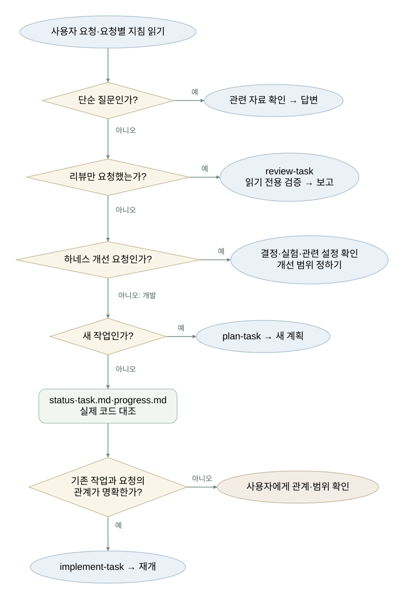
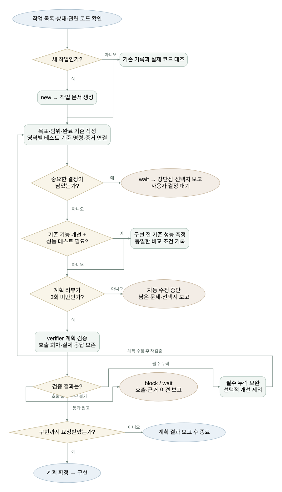
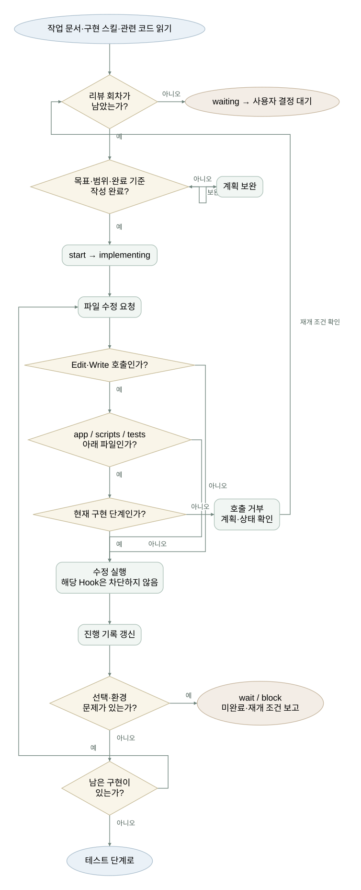
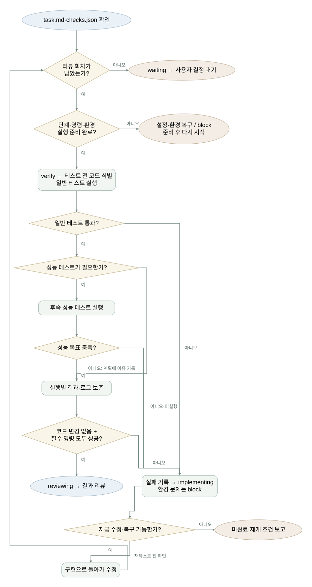
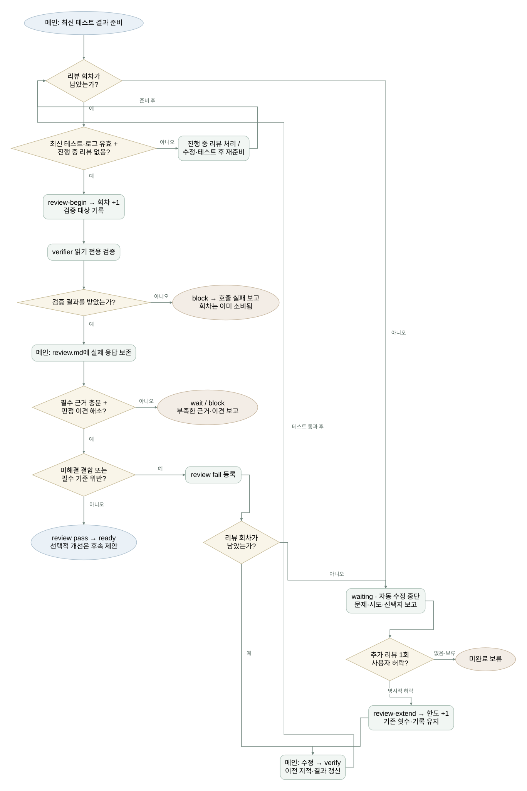
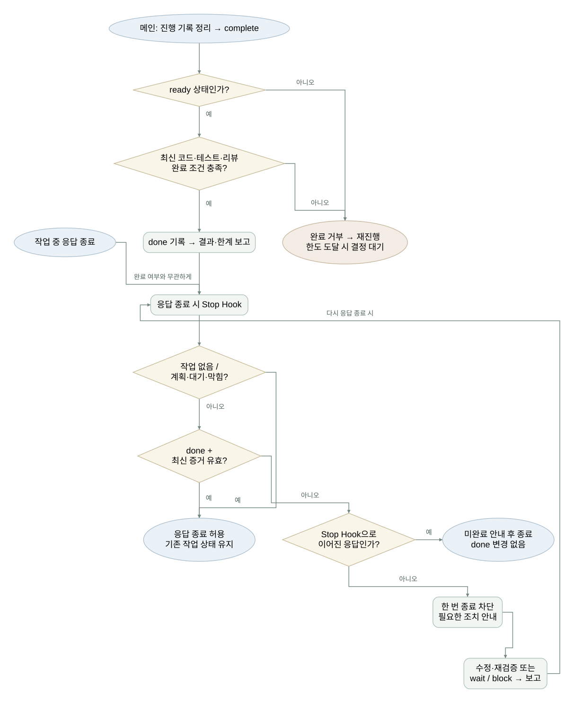

# Claude Code를 활용한 Harness Engineering System 설명서

```text
## 다른 프로젝트로 옮기기 전 설정

범용 하네스를 복사한 뒤에는 해당 프로젝트에 맞게 세부 설정을 조정해야 합니다.

 구조만 보려면 [폴더 구조로 이동하세요](#폴더-구조).

- 기존 설정과 합치기 : 기존 지침·권한·Hook과 충돌하거나 중복되지 않게 정리합니다.
- 필요한 자료 옮기기 : .claude와 연결된 문서·하네스 테스트를 함께 옮기고 경로를 맞춥니다.
- 프로젝트 설명 바꾸기 : 실험용 설명을 실제 프로젝트의 기술·구조·실행 방법으로 바꿉니다.
- 프로젝트 운영 규칙 연결하기 : 공통 상태·증거·완료 게이트는 유지하고 도메인 정책, 코드·테스트 규칙, 이슈·PR 절차, 성능·마이그레이션 보호 규칙을 프로젝트에 맞게 붙입니다. 이슈는 목표와 이유, 하네스 작업은 진행·검증 기록, PR은 변경·팀 리뷰의 원본으로 둡니다.
- 실행 환경 준비하기 : Claude Code·Python 3.9 이상과 필요한 테스트 도구를 준비합니다.
- 코드 경로 맞추기 : 수정 제한 경로와 변경 감지 범위를 실제 소스 구조에 맞춥니다.
- 테스트 명령 연결하기 : harness.json에서 기술 프로필과 프로젝트 검사를 선택하고 실패가 정상적으로 감지되는지 확인합니다.
- 테스트 기준 정하기 : 적용 영역·시나리오·기대 결과와 성능·품질 목표를 정합니다.
- 이전 기록 분리하기 : 이전 작업 상태·증거를 재사용하지 않고, 비밀·로그 보관 기준을 정합니다.
- 검증 담당 확인하기 : 지침·Hook 로딩과 verifier 호출·읽기 전용 권한을 확인합니다.
- 성공·실패 시험하기 : 샘플 작업으로 정상 완료·실패 차단·리뷰 한도·중단 후 재개를 확인합니다.
- CI·배포 연결하기 : 사용하는 CI의 병합·배포 차단 조건과 정기 점검을 연결합니다.

설정 방법과 현재 한계는 [실행 안내](../docs/getting-started.md), 분야별 기준은 [테스트 기준](../docs/testing-policy.md)을 참고하세요.
```

<br/><br/>

## 폴더 구조

> 위에서 아래로 기본 지침 → 작업 기록 → 필요한 절차 순으로 배치했습니다. 모든 파일을 차례로 읽는 것은 아니며, 요청과 진행 단계에 따라 필요한 파일만 읽습니다. settings.json과 hooks는 클로드 코드가 처리하는 실행 설정입니다.

```text
.claude/
├── CLAUDE.md                         # 시작 안내·요청별 분기
├── rules/                            # 공통 작업 규칙
│   ├── workflow.md                   # 진행 순서·상태 관리
│   └── verification.md               # 테스트·완료 기준
│
├── tasks/                            # 현재 작업과 진행 기록
│   ├── index.md                      # 작업 목록
│   ├── active.json                   # 현재 상태 — 작업 생성 시 생성
│   └── <id>/                         # 개별 작업 — 작업 생성 시 생성
│       ├── task.md                   # 구체화 기록·요구사항 ID·완료 기준
│       ├── progress.md               # 진행 상황·다음 행동
│       ├── state.json                # 프로그램이 관리하는 상태
│       ├── plan-review.md            # 계획 검증 결과
│       ├── review.md                 # 리뷰할 때 작성하는 보고서
│       └── evidence/                 # 테스트·리뷰 시 생성하는 증거
│           ├── checks.json           # 최신 실행 결과 사본
│           ├── changes.txt          # 최신 변경 목록 사본
│           ├── verify-NNN/          # 실행별 보존 기록
│           │   ├── checks.json       # 결과·코드 지문·미실행 검사
│           │   ├── check-*.log       # 실행 로그
│           │   └── changes.txt      # 작업 시작 커밋 기준 변경 목록
│           ├── review.json           # 최신 리뷰 판정 사본
│           ├── review-N.json         # 회차별 판정·대상 검사
│           └── review-N.md           # 회차별 리뷰 보고서
│
├── skills/                           # 요청에 맞춰 읽는 작업 절차
│   ├── plan-task/
│   │   ├── SKILL.md                  # 새 작업 계획
│   │   └── templates/
│   │       └── task.md               # 요구사항 작성 양식
│   ├── implement-task/
│   │   ├── SKILL.md                  # 구현·테스트·진행 기록
│   │   └── references/
│   │       └── recovery.md           # 실패·중단 시 복구 안내
│   └── review-task/
│       ├── SKILL.md                  # 요구사항과 결과 리뷰
│       └── templates/
│           └── review.md             # 리뷰 보고서 양식
│
├── agents/                           # 별도 문맥에서 검증하는 담당
│   └── verifier.md                   # 계획·결과 읽기 전용 검증
│
├── settings.json                     # 거부 권한·Hook 연결 설정
│
├── hooks/
│   └── workflow.py                   # 상태 전환·자동 테스트 프로그램
│
├── checks.json                       # harness.json이 없는 기존 설치의 호환 검사 설정
├── snapshot.json                     # Git이 무시하는 검사 입력 파일
│
└── README.md

docs/assets/                          # 설명서용 시각화 (build_diagrams.py로 생성)
```

<br/><br/>

## 전체 구조와 역할

이 하네스는 작업 지침 → 요청 분류 → 계획 → 구현 → 일반 테스트 → 성능 테스트(필요 시) → 리뷰 → 완료 기록·보고를 연결합니다.
계획 단계에서는 목표·범위·완료 기준을 정합니다. Claude가 각 단계의 내용을 판단하고 작업하며, 보조 프로그램은 단계와 실행 증거를 관리합니다.

| 구성                              | 맡은 역할                                   |
| --------------------------------- | ------------------------------------------- |
| CLAUDE.md · rules/                | 작업을 시작하는 방법과 지켜야 할 기준       |
| skills/                           | 계획·구현·리뷰 때 따라갈 구체적인 절차      |
| tasks/                            | 현재 목표, 진행 상황, 테스트·리뷰 결과 보관 |
| agents/verifier.md | 계획·결과의 읽기 전용 검증 담당 |
| settings.json · hooks/workflow.py | 특정 시점에 자동 확인하고 작업 상태 관리    |
| harness.json · profiles/          | 실제로 실행할 기술별·프로젝트별 검사 지정   |

아래 경로는 .claude/ 기준입니다. 모든 파일을 한 번에 읽지 않고, 해당 단계에서 필요한 자료를 사용합니다.

<br/><br/>

## 시작부터 완료까지

> 위에서 아래로 화살표를 따라 읽습니다. 마름모는 조건 판단이며, 화살표의 예·아니오·통과·실패에 따라 경로가 갈라집니다. 되돌아가는 화살표는 반복이고, 대기·보류는 자동 진행을 멈추는 지점입니다.



[확대해서 보기](../docs/assets/workflow.html) · [단계별 그림 모아보기](../docs/assets/index.html)

<br/><br/>

### 1. 시작 : 공통 기준과 현재 작업 확인



[이 단계 크게 보기](../docs/assets/step-1-start.html)

사용 파일: CLAUDE.md, rules/, settings.json, tasks/active.json

클로드 코드가 프로젝트 지침과 공통 규칙을 로딩하고, Hook을 연결합니다.
세션 시작·재개 시 SessionStart Hook이 workflow.py의 hook-session 명령을 실행해 현재 작업과 읽을 문서 위치를 클로드에게 알려줍니다.

결과: 작업 기준과 확인할 자료를 전달받습니다. 작업 문서의 본문은 필요한 단계에서 따로 읽습니다.

<br/>

### 2. 요청 분류 : 필요한 절차 선택



[이 단계 크게 보기](../docs/assets/step-2-route.html)

사용 파일: CLAUDE.md, 선택한 스킬의 SKILL.md

클로드가 요청을 해석하고 지침에 따라 진행할 절차를 선택합니다.

| 요청           | 진행 경로                                 |
| -------------- | ----------------------------------------- |
| 단순 질문      | 관련 자료 확인 → 답변                     |
| 새 개발        | plan-task → 계획 작성                     |
| 기존 개발      | 작업 기록·실제 코드 확인 → implement-task |
| 리뷰만 요청    | review-task → 발견 사항 보고              |
| 작업 방식 개선 | 결정 기록·실험 결과·관련 설정 확인        |

결과: 요청에 맞는 절차를 시작합니다. 질문·리뷰만 요청했다면 구현으로 이어가지 않습니다.

<br/>

### 3. 계획·재개 : 할 일과 완료 기준 확정



[이 단계 크게 보기](../docs/assets/step-3-plan.html)

사용 파일: tasks/index.md, task.md, progress.md, 관련 코드·테스트

새 작업은 plan-task에 따라 자료를 확인하고 new 명령으로 생성합니다.
모호한 요청은 기존 코드·문서로 알 수 있는 사실과 사용자 선택이 필요한 사항을 나눕니다. 중요한 질문을 1~3개씩 묻고 답변을 task.md의 질문·결정 기록에 반영합니다. 답변 뒤 새 모호함이 생기면 다시 질문합니다. 질문이 없다면 조사 근거와 이유를 기록합니다.
task.md에는 원문 요청과 `REQ-번호`별 조건·기대 동작, 목표·범위·완료 기준을 기록합니다. 미결정 질문이 없고 요구사항을 테스트할 수 있을 때 명세 상태를 확정합니다. 다음 행동은 progress.md에 작성합니다.
기존 작업은 status 명령으로 상태를 확인하고 기록과 실제 코드를 대조합니다.
성능 테스트 필요 여부도 여기서 정합니다. 필요하면 측정 조건과 목표를 기록하고, 기존 기능 개선은 구현 전 성능을 측정해 비교 기준을 남깁니다.

verifier에게 적용 영역·상세 기준·시나리오의 누락을 확인받고 결과를 plan-review.md에 남깁니다.
verifier 호출은 Agent Hook이 계획 지문과 함께 상태에 기록합니다. 새 작업의 start는 확정 명세, 미결정 질문 없음, 요구사항 ID, 현재 계획 지문에 대한 호출과 plan-review.md의 `최종 판정: 통과 권고`, 두 기준 표의 데이터 행이 있어야 구현 단계로 넘어갑니다(wait·block을 거쳐도 같음). 구현 중 명세나 테스트 기준이 바뀌면 계획 검증과 start를 다시 거쳐야 Edit·Write·NotebookEdit을 통한 코드 편집과 verify를 진행할 수 있습니다.

결과: 구현할 범위를 확정합니다. 중요한 선택은 사용자와 정하고, 계획만 요청했다면 여기서 마칩니다.

<br/>

### 4. 구현 : 정한 범위 안에서 코드 수정



[이 단계 크게 보기](../docs/assets/step-4-build.html)

사용 파일: implement-task의 SKILL.md, 작업 기록, 관련 규칙·코드·테스트

클로드가 start 명령을 호출하면 프로그램이 계획의 필수 항목을 확인하고 구현 단계로 전환합니다.
클로드는 코드를 수정하고 진행 내용을 progress.md에 남깁니다.

Edit·Write·NotebookEdit 실행 직전에는 PreToolUse Hook이 동작합니다. 구현 단계가 아니면 docs/, 루트 .md, 활성 작업의 task·progress·plan-review·review.md만 수정할 수 있고 나머지(앱 코드, tests/, .claude의 hooks·settings·checks·rules·agents·skills 포함)는 거부합니다. 증거·state.json·active.json·index.md는 어느 단계에서도 도구로 수정할 수 없습니다. settings.json의 Edit 경로 거부는 Claude Code의 Write에도 적용됩니다.
Bash 실행 직전에도 Hook이 동작합니다. 증거·상태 파일을 언급하는 명령, hook 명령 직접 호출, git push·reset --hard·clean·restore·checkout --·--no-verify, rm -r 계열을 거부합니다. 검사 로그는 Read 도구로 읽고, 커밋 시 상태 파일은 디렉토리 단위(`git add .claude/tasks`)로 지정합니다. settings.json의 permissions.deny가 같은 경로·명령을 한 번 더 막습니다.

결과: 변경 코드와 진행 기록을 남기고 테스트로 넘어갑니다.

<br/>

### 5. 테스트 : 기능 확인 후 필요한 성능 측정



[이 단계 크게 보기](../docs/assets/step-5-test.html)

사용 파일: harness.json, profiles/, hooks/workflow.py, 작업 폴더의 evidence/

클로드가 verify 명령을 호출하면 프로그램이 harness.json과 활성 프로필의 테스트를 순서대로 실행합니다. harness.json이 없는 기존 설치만 .claude/checks.json을 사용합니다. 첫 필수 실패나 시간 초과에는 멈추고 이후 검사를 미실행으로 기록합니다.
일반 테스트 뒤에 계획에서 필요하다고 정한 성능 테스트를 별도 명령으로 등록합니다.
응답 시간·처리량·오류율·자원 사용량 중 필요한 지표를 정한 조건에서 측정하고 목표 및 변경 전 결과와 비교합니다.
로그와 실행 결과, 이후 파일 변경을 확인할 값을 evidence/verify-NNN/에 실행별로 보존합니다. 최신 실행은 evidence/checks.json에서 확인합니다.

결과: 통과하면 리뷰로, 실패하면 구현으로 돌아갑니다.

> 테스트 목록이 비었거나 필수 테스트를 실행하지 못하면 통과 처리하지 않습니다. 성능 목표 미달도 실패입니다.

<br/>

### 6. 리뷰 : 요구사항과 구현 결과 대조



[이 단계 크게 보기](../docs/assets/step-6-review.html)

사용 파일: review-task의 SKILL.md, task.md, 변경 코드, 테스트 증거, 리뷰 양식

메인이 review-begin으로 회차를 기록한 뒤 task.md·작업 시작 커밋부터의 변경 파일(evidence/changes.txt)·기준 ID·테스트 증거를 verifier에게 전달합니다. verifier는 읽기 전용으로 누락·결함·근거를 확인하고 결과를 반환합니다. 메인은 실제 응답과 지적별 처리 내역을 review.md에 남기고, 각 `REQ-번호`를 구현 위치·테스트·실행 증거에 연결합니다.
Agent Hook이 verifier 호출을 현재 회차·snapshot과 함께 기록합니다. review pass·fail은 이 기록이 있어야 등록되며, review pass는 review.md에 "## 독립 검증 결과" 본문과 대상 snapshot 문자열도 요구합니다. review-begin 전의 결과 리뷰 호출은 거부됩니다. 기록은 호출 시도만 증명하고 응답 품질은 증명하지 않습니다.

결과: 통과하면 완료 확인으로, 문제가 있으면 수정·테스트·리뷰를 반복합니다. 검증은 verifier가 맡고, 판정 등록과 완료 처리는 메인이 담당합니다.

반복 제한: 최초 리뷰 1회 + 재리뷰 최대 2회입니다. 취향·선택적 개선은 완료를 막지 않으며, 해결한 지적을 새 근거 없이 반복하지 않습니다.

> 세 번째 결과 리뷰도 실패하면 프로그램이 대기 상태로 바꾸고 자동 수정을 멈춥니다.

남은 문제·영향·수정 내역·미해결 이유와 선택지를 보고합니다.
추가 리뷰는 사용자 허락 후 1회씩 늘리며 기존 횟수는 유지합니다. 계획 리뷰 한도는 지침으로 적용하고, 실제 호출·허락 여부의 진위는 프로그램이 증명하지 않습니다.

<br/>

### 7. 완료 : 최종 확인과 결과 보고



[이 단계 크게 보기](../docs/assets/step-7-complete.html)

사용 파일: 현재 상태, task.md, 테스트·리뷰 증거, progress.md

클로드가 진행 기록을 정리하고 complete 명령을 호출합니다.
프로그램은 테스트·리뷰 통과 여부와 증거가 최신 작업 내용에 맞는지 확인한 뒤 완료 상태로 바꿉니다.

응답 종료 시에는 Stop Hook이 상태를 확인합니다. 구현·검사·리뷰 중이면 한 번 종료를 막고 안내합니다. 작업이 없거나 계획·대기·막힘·완료 상태이면 허용하며, 이미 Hook으로 이어진 응답은 다시 막지 않습니다. 완료 이후의 파일 변경은 감시하지 않습니다(다음 작업의 몫). 상태 파일이 손상되면 한 번 막고 사용자 보고를 요구하며, 다른 Hook은 손상 상태에서도 거부 기본값으로 계속 동작합니다.

결과: 완료 처리 후 결과·실행한 테스트·남은 한계를 보고합니다. 응답이 끝났다는 사실만으로 작업이 완료되지는 않습니다.

<br/><br/>

## 더 자세히 알아보기

이 설명서는 구조와 진행 순서를 안내합니다. 세부 기준과 운영 방법은 아래 문서에서 확인하세요.

| 궁금한 내용                                           | 안내 문서                                                                                       |
| ----------------------------------------------------- | ----------------------------------------------------------------------------------------------- |
| 무엇을 언제 테스트하고 통과 기준을 어떻게 정하나요?   | [테스트 기준과 영역별 상세 문서](../docs/testing-policy.md)                                     |
| 명령은 어떻게 실행하고, 어디까지 자동으로 확인하나요? | [실행 방법·역할·자동 확인 범위](../docs/getting-started.md)                                     |
| 실패·중단·사용자 선택 대기 후 어떻게 재개하나요?      | [복구 절차](skills/implement-task/references/recovery.md)                                       |
| 검증 담당은 무엇을 읽고 어떻게 판정하나요?            | [verifier 정의](agents/verifier.md)                                                             |
| 리뷰가 반복되거나 의견이 다르면 어떻게 하나요?        | [리뷰 반복 제한](../docs/testing-policy.md#리뷰-반복-제한)                                      |
| 왜 이렇게 구성했으며 무엇을 시험했나요?               | [결정 기록](../docs/decisions.md) · [실험 기록](../docs/experiments/000-workflow-validation.md) |

구조·설정·절차가 바뀌면 이 설명서도 함께 갱신하도록 CLAUDE.md에 정해 두었습니다.

<br/>

## 참고한 공식 문서

### Claude Code 구성

- [프로젝트 지침과 메모리](https://code.claude.com/docs/en/memory) — CLAUDE.md와 규칙 로딩
- [Hooks](https://code.claude.com/docs/en/hooks) — 이벤트별 실행 시점과 허용·차단 응답
- [Skills](https://code.claude.com/docs/en/skills) — 작업 절차 정의와 관련 자료 연결
- [Subagents](https://code.claude.com/docs/en/sub-agents) — 검증 담당 정의, 별도 문맥, 도구 제한
- [Agent teams](https://code.claude.com/docs/en/agent-teams) — 서브에이전트와 팀 방식 비교; 현재 팀은 미도입

### 테스트·성능·접근성

- [Playwright: Best Practices](https://playwright.dev/docs/best-practices) — 사용자 행동 중심 테스트와 실행 증거
- [Docker: Spring Boot REST API 테스트와 Testcontainers](https://docs.docker.com/guides/testcontainers-java-spring-boot-rest-api/) — 실제 PostgreSQL 통합 테스트
- [Google: Web Vitals](https://web.dev/articles/vitals) — LCP·INP·CLS와 실험·실사용 측정 구분
- [Grafana k6: Metrics](https://grafana.com/docs/k6/latest/using-k6/metrics/) — 응답 시간·요청 실패율 등 성능 지표
- [Grafana k6: Thresholds](https://grafana.com/docs/k6/latest/using-k6/thresholds/) — 성능 목표와 테스트 실패 판정
- [W3C: WCAG 2.2](https://www.w3.org/TR/WCAG22/) — 접근성 테스트 기준

### 보안·AI·운영

- [OWASP: ASVS 공식 저장소](https://github.com/OWASP/ASVS) — 애플리케이션 보안 검증 요구사항
- [OWASP: 생성형 AI 위험 목록](https://genai.owasp.org/llm-top-10/) — 프롬프트 공격·정보 노출·도구 권한 등 AI 보안 위험
- [Kubernetes: Liveness, Readiness, Startup Probes](https://kubernetes.io/docs/tasks/configure-pod-container/configure-liveness-readiness-startup-probes/) — 기동·준비·생존 상태 검사

### 검증 강화 논의에서 참고한 자료

- [Google SRE: Testing for Reliability](https://sre.google/sre-book/testing-reliability/) — 신뢰성을 위한 테스트 접근
- [PIT: Mutation Testing](https://pitest.org/) — 코드에 변형을 넣어 테스트의 결함 탐지 능력을 확인하는 기법; 현재 미도입
- [SLSA: Provenance v1.2](https://slsa.dev/spec/v1.2/provenance) — 소스·실행 과정·산출물의 출처를 연결하는 개념 참고; SLSA 준수 구현은 아님

리뷰 횟수 제한, 단계 구성, 완료 조건은 이 프로젝트에서 정한 정책입니다. 위 공식 문서가 해당 정책 전체를 필수로 규정하는 것은 아닙니다.
