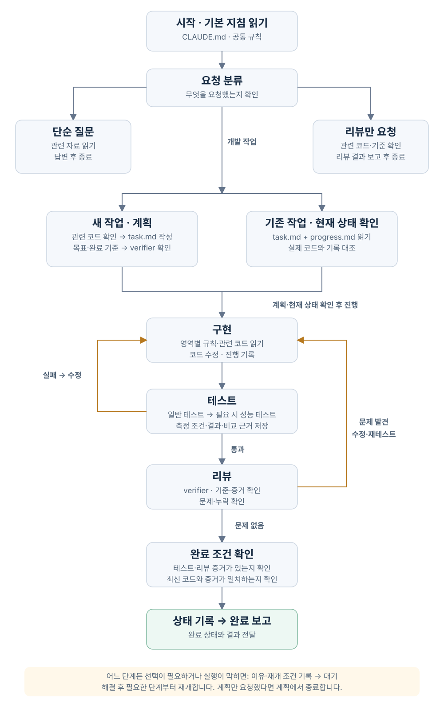

# Claude Code를 활용한 Harness Engineering System 설명서

```text
.claude/
├── CLAUDE.md                         # 시작 안내·요청별 분기
├── rules/                            # 공통 작업 규칙
│   ├── workflow.md                   # 진행 순서·상태 관리
│   └── verification.md               # 테스트·완료 기준
│
├── tasks/                            # 현재 작업과 진행 기록
│   ├── index.md                      # 작업 목록
│   ├── active.json                   # 현재 상태 — 작업 생성 시 생성
│   └── <id>/                         # 개별 작업 — 작업 생성 시 생성
│       ├── task.md                   # 목표·범위·완료 기준
│       ├── progress.md               # 진행 상황·다음 행동
│       ├── state.json                # 프로그램이 관리하는 상태
│       ├── plan-review.md            # 계획 검증 결과
│       ├── review.md                 # 리뷰할 때 작성하는 보고서
│       └── evidence/                 # 테스트·리뷰 시 생성하는 증거
│           ├── checks.json           # 테스트 결과·코드 지문
│           ├── check-*.log           # 테스트 실행 로그
│           └── review.json           # 리뷰 판정·보고서 지문
│
├── skills/                           # 요청에 맞춰 읽는 작업 절차
│   ├── plan-task/
│   │   ├── SKILL.md                  # 새 작업 계획
│   │   └── templates/
│   │       └── task.md               # 요구사항 작성 양식
│   ├── implement-task/
│   │   ├── SKILL.md                  # 구현·테스트·진행 기록
│   │   └── references/
│   │       └── recovery.md           # 실패·중단 시 복구 안내
│   └── review-task/
│       ├── SKILL.md                  # 요구사항과 결과 리뷰
│       └── templates/
│           └── review.md             # 리뷰 보고서 양식
│
├── agents/                           # 별도 문맥에서 검증하는 담당
│   └── verifier.md                   # 계획·결과 읽기 전용 검증
│
├── settings.json                     # 권한·Hook 연결 설정
│
├── hooks/
│   └── workflow.py                   # 상태 전환·자동 테스트 프로그램
│
├── checks.json                       # 실행할 필수 테스트 명령
│
├── README.md
│
└── assets/                           # 설명서용 시각화
    ├── workflow.svg                  # 작업 흐름 그림
    └── workflow.html                 # 확대해서 보는 작업 흐름
```

## 전체 구조와 역할

이 하네스는 **작업 지침 → 요청 분류 → 계획 → 구현 → 일반 테스트 → 성능 테스트(필요 시) → 리뷰 → 완료 기록·보고**를 연결합니다.
계획 단계에서는 목표·범위·완료 기준을 정합니다. Claude가 각 단계의 내용을 판단하고 작업하며, 보조 프로그램은 단계와 실행 증거를 관리합니다.

| 구성                                  | 맡은 역할                                   |
| ------------------------------------- | ------------------------------------------- |
| CLAUDE.md · rules/                | 작업을 시작하는 방법과 지켜야 할 기준       |
| skills/                             | 계획·구현·리뷰 때 따라갈 구체적인 절차      |
| tasks/                              | 현재 목표, 진행 상황, 테스트·리뷰 결과 보관 |
| settings.json · hooks/workflow.py | 특정 시점에 자동 확인하고 작업 상태 관리    |
| checks.json                         | 실제로 실행할 테스트 명령 지정              |

아래 경로는 .claude/ 기준입니다. 모든 파일을 한 번에 읽지 않고, 해당 단계에서 필요한 자료를 사용합니다.

## 시작부터 완료까지



[확대해서 보기](assets/workflow.html)

### 1. 시작 : 공통 기준과 현재 작업 확인

**사용 파일:** CLAUDE.md, rules/, settings.json, tasks/active.json

클로드 코드가 프로젝트 지침과 공통 규칙을 로딩하고, Hook을 연결합니다.
세션 시작·재개 시 SessionStart Hook이 workflow.py의 hook-session 명령을 실행해 현재 작업과 읽을 문서 위치를 클로드에게 알려줍니다.

**결과:** 작업 기준과 확인할 자료를 전달받습니다. 작업 문서의 본문은 필요한 단계에서 따로 읽습니다.

### 2. 요청 분류 : 필요한 절차 선택

**사용 파일:** CLAUDE.md, 선택한 스킬의 SKILL.md

클로드가 요청을 해석하고 지침에 따라 진행할 절차를 선택합니다.

| 요청 | 진행 경로 |
| --- | --- |
| 단순 질문 | 관련 자료 확인 → 답변 |
| 새 개발 | plan-task → 계획 작성 |
| 기존 개발 | 작업 기록·실제 코드 확인 → implement-task |
| 리뷰만 요청 | review-task → 발견 사항 보고 |
| 작업 방식 개선 | 결정 기록·실험 결과·관련 설정 확인 |

**결과:** 요청에 맞는 절차를 시작합니다. 질문·리뷰만 요청했다면 구현으로 이어가지 않습니다.

### 3. 계획·재개 : 할 일과 완료 기준 확정

**사용 파일:** tasks/index.md, task.md, progress.md, 관련 코드·테스트

새 작업은 plan-task에 따라 자료를 확인하고 new 명령으로 생성합니다.
목표·범위·완료 기준은 task.md에, 다음 행동은 progress.md에 작성합니다.
기존 작업은 status 명령으로 상태를 확인하고 기록과 실제 코드를 대조합니다.
성능 테스트 필요 여부도 여기서 정합니다. 필요하면 측정 조건과 목표를 기록하고, 기존 기능 개선은 구현 전 성능을 측정해 비교 기준을 남깁니다.

verifier에게 적용 영역·상세 기준·시나리오의 누락을 확인받고 결과를 plan-review.md에 남깁니다.

**결과:** 구현할 범위를 확정합니다. 중요한 선택은 사용자와 정하고, 계획만 요청했다면 여기서 마칩니다.

### 4. 구현 : 정한 범위 안에서 코드 수정

**사용 파일:** implement-task의 SKILL.md, 작업 기록, 관련 규칙·코드·테스트

클로드가 start 명령을 호출하면 프로그램이 계획의 필수 항목을 확인하고 구현 단계로 전환합니다.
클로드는 코드를 수정하고 진행 내용을 progress.md에 남깁니다.

Edit·Write 실행 직전에는 PreToolUse Hook이 동작합니다. app/, scripts/, tests/ 아래 파일은 구현 단계에서만 수정하도록 제한합니다. Bash나 직접 편집은 이 제한에 포함되지 않습니다.

**결과:** 변경 코드와 진행 기록을 남기고 테스트로 넘어갑니다.

### 5. 테스트 : 기능 확인 후 필요한 성능 측정

**사용 파일:** checks.json, hooks/workflow.py, 작업 폴더의 evidence/

클로드가 verify 명령을 호출하면 프로그램이 checks.json에 등록된 테스트를 실행합니다.
일반 테스트 통과 후, 계획에서 필요하다고 정한 작업만 성능 테스트를 실행합니다.
응답 시간·처리량·오류율·자원 사용량 중 필요한 지표를 정한 조건에서 측정하고 목표 및 변경 전 결과와 비교합니다.
로그와 실행 결과, 이후 파일 변경을 확인할 값을 evidence/에 저장합니다.

**결과:** 통과하면 리뷰로, 실패하면 구현으로 돌아갑니다. 테스트 목록이 비었거나 필수 테스트를 실행하지 못하면 통과 처리하지 않습니다. 성능 목표 미달도 실패입니다.

### 6. 리뷰 : 요구사항과 구현 결과 대조

**사용 파일:** review-task의 SKILL.md, task.md, 변경 코드, 테스트 증거, 리뷰 양식

메인이 task.md·변경 파일·기준 ID·테스트 증거를 verifier에게 전달합니다. verifier는 읽기 전용으로 누락·결함·근거를 확인하고 결과를 반환합니다. 메인은 실제 응답과 지적별 처리 내역을 review.md에 남깁니다.
review pass 또는 review fail 명령으로 판정을 등록하면 프로그램이 증거를 저장합니다.

**결과:** 통과하면 완료 확인으로, 문제가 있으면 수정·테스트·리뷰를 반복합니다. 검증은 verifier가 맡고, 판정 등록과 완료 처리는 메인이 담당합니다.

### 7. 완료 : 최종 확인과 결과 보고

**사용 파일:** 현재 상태, task.md, 테스트·리뷰 증거, progress.md

클로드가 진행 기록을 정리하고 complete 명령을 호출합니다.
프로그램은 테스트·리뷰 통과 여부와 증거가 최신 작업 내용에 맞는지 확인한 뒤 완료 상태로 바꿉니다.

응답 종료 시에는 Stop Hook이 상태와 증거를 확인합니다. 미완료 개발 작업이면 한 번 종료를 막고 안내합니다. 작업이 없거나 계획·대기·막힘 상태이면 허용하며, 이미 Hook으로 이어진 응답은 다시 막지 않습니다.

**결과:** 완료 처리 후 결과·실행한 테스트·남은 한계를 보고합니다. 응답이 끝났다는 사실만으로 작업이 완료되지는 않습니다.

## 테스트 범위와 실행 시점

프론트·백엔드를 각각 테스트하고, 연결된 핵심 사용자 흐름도 확인합니다.
계획에서 정상·실패·경계값·권한·동시 요청 중 필요한 시나리오를 완료 기준과 연결합니다.

| 시점 | 확인할 내용 |
| --- | --- |
| 개발 중 | 변경한 기능의 빠른 테스트 |
| 완료·병합 전 | 필수 일반 테스트·통합 테스트·핵심 사용자 흐름 |
| 성능 관련 변경 | 일반 테스트 통과 후 성능 비교 |
| 배포 전·후 | 실제 환경에 가까운 점검과 배포 후 핵심 기능 확인 |
| 정기 점검 | 장시간 부하·장애 복구·보안 |

필수 테스트 실패·미실행은 완료로 처리하지 않습니다. 재시도 전 실패도 보존하며, 커버리지 숫자만으로 품질을 판단하지 않습니다.
[테스트 기준](../docs/testing-policy.md)에서 적용 영역을 고른 뒤 필요한 상세 문서만 읽습니다.

| 상세 문서 | 주요 내용 |
| --- | --- |
| [프론트](../docs/testing/frontend.md) | 입력·상태·브라우저·접근성 |
| [백엔드](../docs/testing/backend.md) | API·DB·롤백·동시성·메시지 |
| [AI](../docs/testing/ai.md) | 제품 LLM·RAG·도구·멀티에이전트 평가 |
| [DevOps](../docs/testing/devops.md) | 빌드·배포·관측·백업 복구 |
| [보안](../docs/testing/security.md) | 권한·입력 공격·비밀·의존성 |
| [성능](../docs/testing/performance.md) | 부하·지표·조건·회귀 |
| [전체 흐름](../docs/testing/e2e.md) | 실제 연동·실패 복구·회귀 |

각 문서에는 기준 ID·테스트 방법·통과 기준·증거가 있습니다. task.md에 적용 여부와 실행 계획을 연결합니다.
현재 구현된 것은 작업 완료 확인이며, CI 병합·배포 차단과 정기 실행은 아직 연결하지 않았습니다.

## 도중에 선택·실패·중단이 생기면

| 상황                       | 처리와 사용하는 자료                                         |
| -------------------------- | ------------------------------------------------------------ |
| 사용자 선택 필요           | 장단점 설명 → 이유·다음 행동 기록 → wait → 질문            |
| 실행 환경 때문에 진행 불가 | 복구 안내 확인 → 원인·재개 조건 기록 → block → 미완료 보고 |
| 테스트 실패                | evidence/check-*.log 확인 → 수정 → verify                |
| 리뷰에서 문제 발견         | review fail → 수정 → 테스트·리뷰 반복                      |
| 중단 후 재개               | status와 작업 문서·실제 코드 대조 → 필요한 단계부터 진행   |

실패·기록 불일치·중단 후 복구 때는 skills/implement-task/references/recovery.md를 추가로 읽습니다.
작업 방식의 변경 이유는 ../docs/decisions.md, 실험 결과는 ../docs/experiments/에 남깁니다.

## 자동으로 하는 일과 클로드가 하는 일

| 담당          | 하는 일                                                                 |
| ------------- | ----------------------------------------------------------------------- |
| 클로드 코드 | 등록된 시점에 Hook 명령 실행                                            |
| 클로드 | 요청 분류, 자료 읽기, 계획·구현·리뷰, 필요한 명령 호출, 사용자에게 보고 |
| verifier | 계획 누락과 코드·테스트·증거를 읽기 전용 검증 |
| workflow.py | 호출받은 명령에 따라 상태 변경, 테스트 실행, 증거 저장·확인             |

**Hook의 실행 시점은 [settings.json](settings.json), 처리 내용은 [workflow.py](hooks/workflow.py)에 정의되어 있습니다.**
Hook 3개가 전체 개발을 자동 진행시키는 것은 아닙니다. verify·complete 같은 명령은 Claude가 지침에 따라 호출해야 합니다.

현재는 메인 한 세션과 읽기 전용 verifier로 작업 하나를 진행합니다. 테스트 실행·코드 수정·상태 변경은 메인만 담당합니다.
verifier 호출 실패나 미해결 중요 지적이 있으면 완료하지 않는 지침을 적용합니다. 프로그램이 서브에이전트 호출 진위까지 자동 증명하는 구조는 아닙니다.
테스트의 적절성이나 계획·리뷰의 품질까지 프로그램이 보장하지는 않습니다.
보조 프로그램 테스트는 마쳤으며, 실제 Claude 대화에서 흐름이 지켜지는지는 앱 실험으로 확인해야 합니다.

## 설명서 관리와 상세 자료

구조·설정·작업 절차·명령이 바뀌면 이 설명서도 함께 갱신하도록 CLAUDE.md에 정해 두었습니다.
진행 기록이나 로그만 바뀌면 설명서를 수정할 필요는 없습니다.

- [명령 실행법과 자세한 통제 범위](../docs/getting-started.md)
- [결정 기록](../docs/decisions.md)
- [보조 프로그램 검증 결과](../docs/experiments/000-workflow-validation.md)
- [Claude Code 공식 지침 문서](https://code.claude.com/docs/en/memory)
- [Claude Code 공식 Hook 문서](https://code.claude.com/docs/en/hooks)
